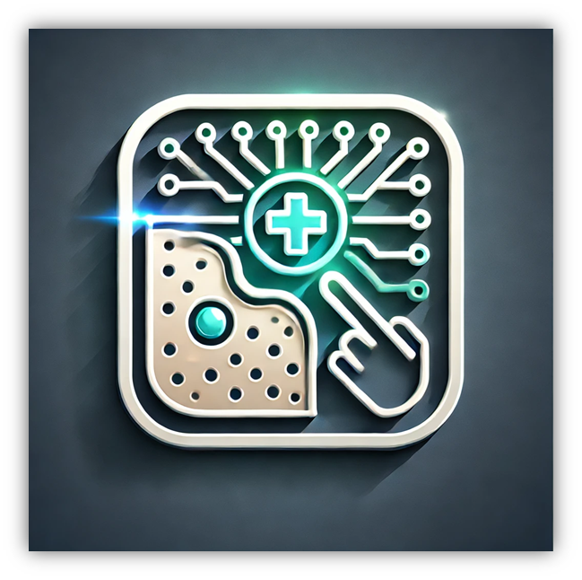

Hello World

Nice to meet you! My name is Mohamed Khalil Ben Nasr. I am an international student from tunisia. I am a Senior in Lawrence University, majoring in Computer Science.
I'm a passionate software developer with a strong background in computer science, full-stack development, AI, and AWS Cloud technologies.
Attending Lawrence wasn't just about attaining academic excellence and learning computer science, it was also an enlightening journey that helped me learn about myself through the different experiences i went though
i was able to understand that my goal in life is to make a positive impact and help people in my own way
My mission is to leverage my technical skills to make a meaningful impact in healthcare and empower those in need.
I aim to create innovative solutions that improve lives and foster hope.

Motivation: Healthcare Challenges Around the World (i want the tunisian and american section to be displayed horizantally next to each other like in a div wehre flex-horizantal)

- Uneven distribution of healthcare services across regions
- Inadequate funding for public healthcare
- A shortage of medical professionals due to high-skilled immigration
- Poor access to specialized care

- No national health insurance, which is against universal healthcare and SDGs devised by the UN
- Millions of Americans remain uninsured, underinsured, or unsure of their coverage
- Leading cause of personal bankruptcy is medical debt
- Healthcare is inaccessible to underprivileged and underrepresented communities

Mission
Healthcare stands as a fundamental pillar in any society, holding a central place in building resilient and sustainable nations.
I want to contribute my efforts towards the achievement of human security and a global society that leaves no one’s health behind, using technology.

SkinGuardian’ s Focus: Why Skin Cancer?

Skin Cancer is the most common cancer in the United States and worldwide.
Skin cancer can affect anyone, regardless of skin color.

Skin Cancer Risk Factors:
UV light exposure
Skin type
Family / personal history of skin cancer
Weak immune system
Age

Skin Cancer is the cancer you see.
That’s why skin exams, both at home and with a dermatologist, are especially vital.

Early detection saves lives.
Learning what to look for on your own skin gives you the power to detect cancer early when it’s easiest to cure, before it can become dangerous, disfiguring or deadly.

That is why I am working on:SkinGuardian

An AI-powered digital companion for the early detection of skin cancer

The vision behind SkinGuardian (i want the vision details to be displayed horizantally next to each other like in a div wehre flex-horizantal)

Classify skin lesions and support self-conducted skin exams

Generate medically accurate diagnosis, especially when access to dermatologists is limited

Help in the prevention of skin cancer through personalized recommendations and lifestyle factors tracking

SkinGuardian Overview

SkinGuardian is a full-stack, cloud-based platform designed for the early detection of skin cancer. The system leverages a multimodal deep learning model that combines visual features (extracted via ResNet50) with clinical metadata to deliver real-time skin lesion classification. The platform is built with a robust, secure, and scalable architecture using modern web and cloud technologies.

SkinGuardian AI Model
Developed a multimodal deep learning model that fuses visual features from ResNet50 with clinical metadata via a custom
clinical feature extractor with embedding layers and neural network-based fusion layer. My model Achieved 90% test accuracy and weighted F1 score on HAM10000, outperforming baseline single-modality models.

SkinGuardian AI Model Architecture

SkinGuardian AI Model Results

SkinGuardian System Architecture

Overview

High-Level Components
Frontend:
Developed with React, Vite, and TypeScript using Shadcn UI for styling, the frontend is deployed via AWS Amplify. Amplify manages the CI/CD pipeline by integrating directly with GitHub, ensuring that every update is automatically built and deployed.

Domain & Load Balancing:
The custom domain is managed through AWS Route 53, which points to an Application Load Balancer (ALB). The ALB terminates SSL connections using an ACM-issued certificate and routes secure HTTPS traffic to the backend.

Backend:
The Spring Boot API is hosted on an EC2 instance in a public subnet. It is secured with JWT-based authentication, and only specific endpoints (e.g., login and signup) are publicly accessible. All other endpoints require a valid JWT for access. A CI/CD pipeline for the backend is implemented using GitHub Actions and Docker, automating builds, image creation, and deployments.

Data & AI Services:
The backend integrates with an AWS RDS MySQL database in a private subnet for storing application data, and uses an S3 bucket to store skin lesion images. The AI model is deployed as an inference endpoint on AWS SageMaker, enabling real-time diagnosis.

Security:
AWS WAF is deployed in front of the ALB to provide application layer security, filtering out malicious traffic. Additionally, security groups are strictly configured: the EC2 instance only accepts traffic from the ALB, and the RDS instance only accepts connections from the EC2 instance’s security group. Spring Security enforces JWT authentication across secure endpoints.

Data Flow & Workflow
User Interaction & Frontend:

Users access the SkinGuardian website via the custom domain.
The frontend, built with React, makes secure HTTPS requests to the backend using the custom domain.
Load Balancing & Security:

Route 53 resolves the custom domain to the ALB.
The ALB, protected by AWS WAF, terminates SSL and forwards traffic to the backend EC2 instance.
Backend Processing & Data Management:

The Spring Boot API on EC2 processes requests, handles authentication via JWT, and interacts with the RDS MySQL database for application data.
For diagnoses, image and clinical data are sent to the AI model endpoint.
AI Model Inference:

The multimodal deep learning model on AWS SageMaker processes the data and returns a classification result to the backend, which then sends it to the frontend.
Continuous Integration & Deployment:

The frontend uses AWS Amplify for CI/CD, while the backend is automatically built and deployed using GitHub Actions and Docker, ensuring the system remains up-to-date with every commit.
Security Measures
JWT Authentication:
Secure endpoints require a valid JWT token, ensuring that only authenticated users can access sensitive features.

AWS WAF:
Provides a protective barrier at the ALB, filtering out common web exploits and malicious traffic.

Strict Security Groups:
The EC2 instance only accepts traffic from the ALB, and the RDS instance is restricted to traffic coming from the EC2 instance, reducing exposure to the public internet.

Example User interaction
User signs up
user makes profile
user submits the new diagnosis form with the required "localization" and "image"
user checks history tab to track self-conducted skin exams and mole diagnoses

Conclusion
SkinGuardian integrates advanced deep learning with a secure, scalable full-stack architecture on AWS. The system leverages modern CI/CD practices, cloud-native services, and robust security measures to provide reliable, real-time skin lesion diagnosis. This documentation outlines the high-level architecture, data flow, and security design, offering insight into the end-to-end operation of the platform.
