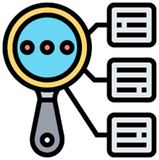

# SkinGuardian Documentation

Welcome to **SkinGuardian** – your digital AI-companion for the early detection of skin cancer.

---

## Table of Contents

- [Introduction](#introduction)
- [Motivation](#motivation)
  -[SkinGuardian's Focus: Why Skin Cancer?](#skinguardians-focus-why-skin-cancer)
- [Project Overview](#project-overview)
  - [The Vision Behind SkinGuardian](#the-vision-behind-skinguardian)
  - [AI-Driven Diagnosis](#ai-driven-diagnosis)
  - [Full-Stack Cloud Architecture](#full-stack-cloud-architecture)
- [System Architecture](#system-architecture)
- [Data Flow & Workflow](#data-flow--workflow)
- [Security Measures](#security-measures)
- [Example User Interaction](#example-user-interaction)
- [Next Steps](#next-steps)
- [Conclusion](#conclusion)
- [Associated Repositories and Additional Resources](#associated-repositories-and-additional-resources)

---

## Introduction

Hello, my name is **Mohamed Khalil Ben Nasr**. I am an international student from Tunisia, currently a Senior at Lawrence University majoring in Computer Science (with a minor in Statistics and Data Science). I'm a passionate software developer with a strong background in full-stack development, artificial intelligence, and AWS Cloud technologies. My mission is to leverage my technical skills to make a meaningful impact the world and empower those in need.

This documentation provides a comprehensive overview of SkinGuardian, a project designed to leverage cutting-edge deep learning techniques for early skin cancer detection.

---

## Motivation

I lived in Tunisia and the USA for most of my life, where I experienced healthcare challenges first-hand. Below are my two perspectives of the healthcare challenges in both countries:

|  |  |
|--------------------------------------|----------------------------------|
| **Tunisian Challenges:**   - Uneven distribution of healthcare services   - Inadequate funding for public healthcare   - Shortage of medical professionals due to high-skilled immigration   - Poor access to specialized care | **American Challenges:**   - Lack of national health insurance; millions uninsured or underinsured   - Medical debt as a leading cause of personal bankruptcy   - Healthcare inaccessibility for underprivileged communities |

**Mission:**  

  
Healthcare is a fundamental pillar for building resilient and sustainable societies. My goal is to leverage technology to make a positive impact in healthcare, ensuring no one’s health is left behind.  

  

### SkinGuardian's Focus: Why Skin Cancer?

Skin Cancer is the most common cancer in the United States and worldwide. It can affect anyone, regardless of skin color.

    

Skin Cancer Risk Factors:
<ul>
    <li> - UV light exposure</li>
    <li> - Skin type</li>
    <li> - Family/ personal history of skin cancer</li>
    <li> - Weak immune system</li>
    <li> - Age </li>
</ul>

**Skin Cancer is the cancer you see.** 
That’s why skin exams, both at home and with a dermatologist, are especially vital.

**Early detection saves lives.** 
Learning what to look for on your own skin gives you the power to detect cancer early when it’s easiest to cure, before it can become dangerous, disfiguring or deadly.

    

---

## Project Overview

**SkinGuardian** is a full-stack, cloud-based platform designed for the early detection of skin cancer. It combines advanced AI with a secure, scalable architecture on AWS to provide real-time diagnosis and personalized recommendations.

### The Vision Behind SkinGuardian

|  |  |  |
|----------------------------------|----------------------------------|----------------------------------|
| **Classify skin lesions and support self-conducted skin exams** | **Generate medically accurate diagnosis, especially when access to dermatologists is limited** | **Help in the prevention of skin cancer through personalized recommendations and lifestyle factors tracking** |

### AI-Driven Diagnosis

- **Multimodal Deep Learning Model:**
  - Fuses visual features from ResNet50 with clinical metadata using a custom clinical feature extractor and neural network-based fusion layer.
  - Achieved **90% test accuracy** and **90% weighted F1 score** on the HAM10000 dataset.
- **Deployment:**
  - Deployed as an AWS SageMaker inference endpoint for real-time skin lesion classification.
- **Model Architecture:**
  
- **Model Performance Results**
  

---

### Full-Stack Cloud Architecture

- **Backend:**

  - Built with Spring Boot and secured with JWT authentication.
  - Hosted on an EC2 instance in a public subnet; only accepts traffic from an Application Load Balancer (ALB).
  - CI/CD pipeline implemented with GitHub Actions and Docker for seamless updates.
  - Integrates with an AWS RDS MySQL database (in a private subnet) and an S3 bucket for storing skin lesion images.

- **Frontend:**

  - Developed with React, Vite, and TypeScript using Shadcn UI for styling.
  - Deployed via AWS Amplify, which is linked to a GitHub repository and manages CI/CD automatically.
  - A custom domain in Route 53 points to the ALB for secure HTTPS traffic.

- **Load Balancing & Security:**
  - ALB terminates SSL using an ACM certificate and routes secure traffic to the backend.
  - AWS WAF is deployed in front of the ALB to block malicious traffic.
  - Security groups enforce strict communication rules between ALB, EC2, and RDS.

---

## System Architecture

Below is a high-level diagram illustrating the system architecture:

---

## Data Flow & Workflow

### User Interaction & Frontend

- **Website Access:** Users access the SkinGuardian website via https://main.d374fmb5qt34h7.amplifyapp.com/.
- **Secure Requests:** The React-based frontend makes secure HTTPS requests to the backend.

### Load Balancing & Security

- **DNS Resolution:** Route 53 resolves the custom domain to the Application Load Balancer (ALB).
- **SSL Termination:** The ALB, protected by AWS WAF, terminates SSL and forwards traffic to the backend.

### Backend Processing

- **API Handling:** The Spring Boot API on EC2 processes requests and enforces JWT authentication.
- **Data Storage:** User data is stored in an AWS RDS MySQL database, while skin lesion images are stored in an S3 bucket.
- **AI Inference:** For diagnoses, image and clinical data are sent to the AWS SageMaker inference endpoint, which returns classification results.

### CI/CD Integration

- **Frontend CI/CD:** The frontend is automatically built and deployed via AWS Amplify.
- **Backend CI/CD:** The backend is continuously integrated and deployed using GitHub Actions and Docker.

---

## Security Measures

- **JWT Authentication:** Secure endpoints require a valid JWT token, ensuring only authenticated users can access sensitive features.
- **AWS WAF:** Protects the ALB from malicious traffic, blocking common web exploits.
- **Strict Security Groups:**
  - The EC2 instance only accepts traffic from the ALB.
  - The RDS instance is restricted to connections from the EC2 instance’s security group.
- **SSL Termination:** The ALB terminates SSL using an ACM certificate, ensuring secure data transmission between clients and the backend.

---

## Example User Interaction

- **User Signs Up:** Registers on the platform and logs in to receive a JWT token.
- **User Creates a Profile:** Completes a profile with clinical data.
- **User Submits a Diagnosis:** Uploads an image and selects the lesion localization via a diagnosis form.
- **User Views History:** Checks past diagnoses in a history tab, enabling self-conducted skin exams.

---

## Next Steps

|  |  |  |
|----------------------------------|----------------------------------|----------------------------------|
| **Generate accurate clinical diagnoses and personalized reccomendations** | **Improve SkinGuardian's model performance and UI design** | **Advertize SkinGuardian to help those in need and make an impact** |

---

## Conclusion

SkinGuardian seamlessly integrates advanced deep learning with a robust, secure full-stack architecture on AWS. The platform leverages state-of-the-art CI/CD practices, cloud-native services, and comprehensive security measures to deliver reliable, real-time skin lesion diagnosis and personalized healthcare recommendations.

---

## Associated Repositories and Additional Resources

SkinGuardian Front-End Github Repository: https://github.com/Mohamed-Khalil-Ben-Nasr/SkinGuardian-Front-End
SkinGuardian Back-End Github Repository: https://github.com/Mohamed-Khalil-Ben-Nasr/SkinGuardian-Back-End
SkinGuardian AI Model Github Repository: https://github.com/Mohamed-Khalil-Ben-Nasr/SkinGuardian-AI-Model
